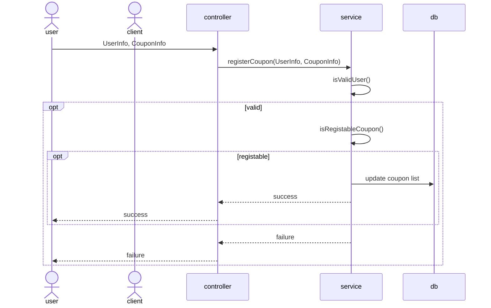
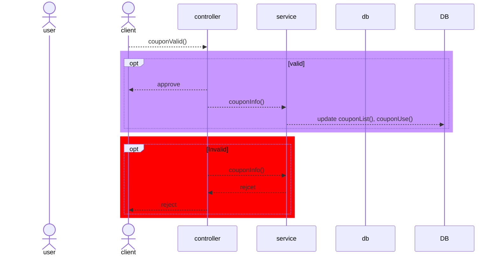

# 쿠폰 등록 

```mermaid
sequenceDiagram
    actor user
    actor cl as client
    participant ctr as controller
    participant s as service
    participant db
    
    user->>ctr : UserInfo, CouponInfo
    ctr->>s: registerCoupon(UserInfo, CouponInfo)
    s ->> s : isValidUser()
    opt valid
        %% opt는 조건문과 동일하다. 코드 작성할 때 if와 동일
        s->>s: isRegistableCoupon()
        opt registable
            s ->> db: update coupon list
            s-->> ctr: success
            ctr-->> user: success
        end
    s-->>ctr: failure
    ctr -->> user: failure
    end


```

# 쿠폰 사용

```mermaid
sequenceDiagram
    actor user
    actor cl as client
    participant ctr as controller
    participant s as service
    participant db
    
    cl -->>ctr: couponValid()
    rect rgb(200,150,255)
        opt valid
            ctr -->> cl: approve
            ctr -->> s: couponInfo()
            s -->> DB: update couponList(), couponUse()
        end
    end
    rect rgb(255,0,0)
        opt Invalid
            ctr -->> s: couponInfo()
            s -->> ctr: rejcet
            ctr -->> cl: reject
        end
    end
```
